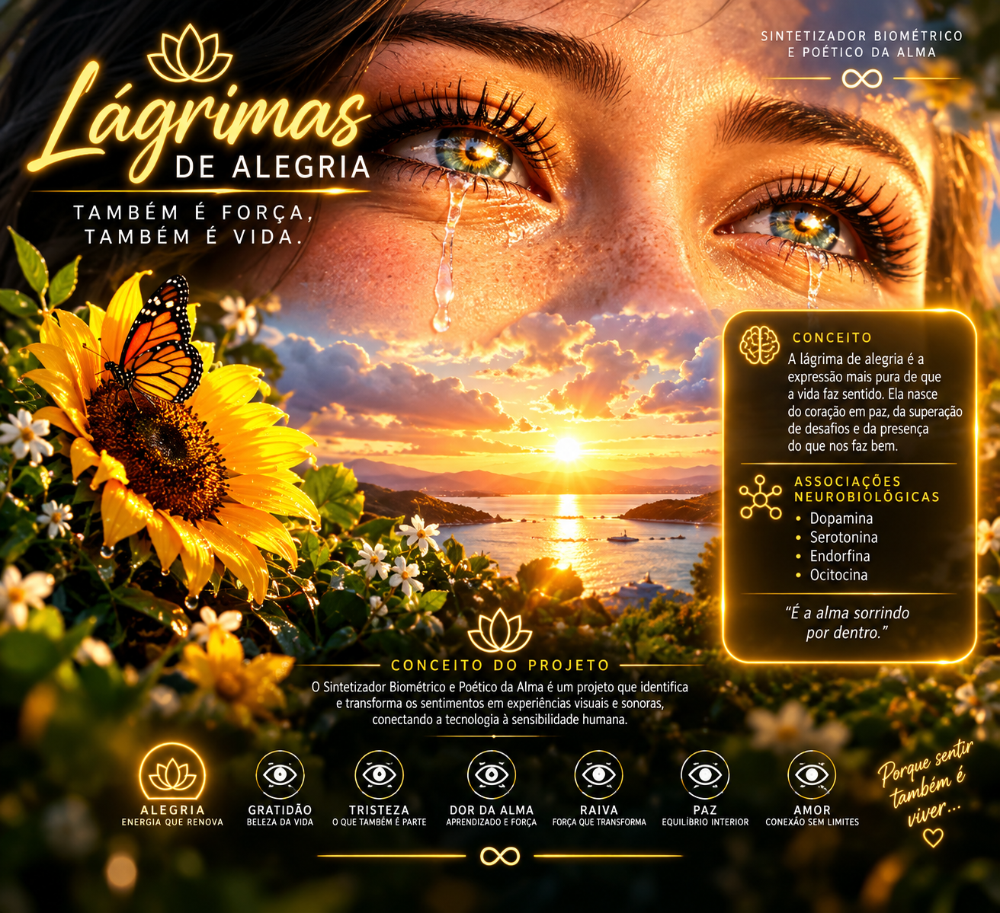
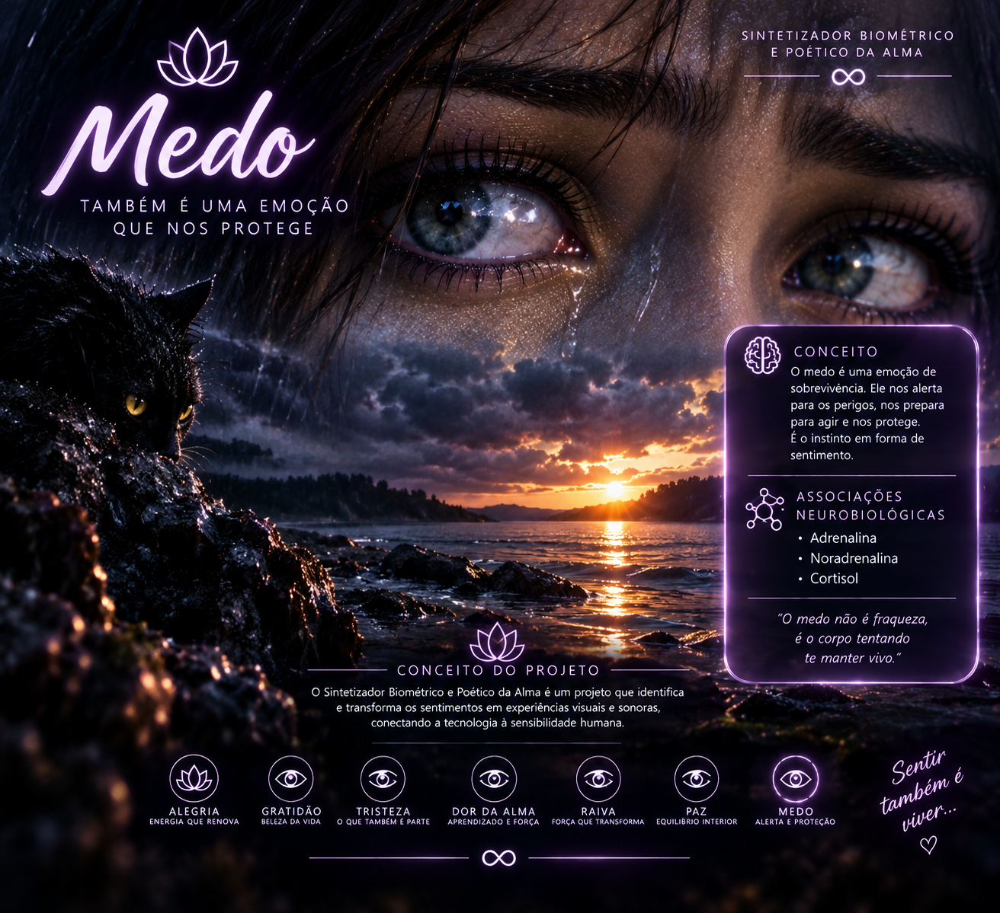
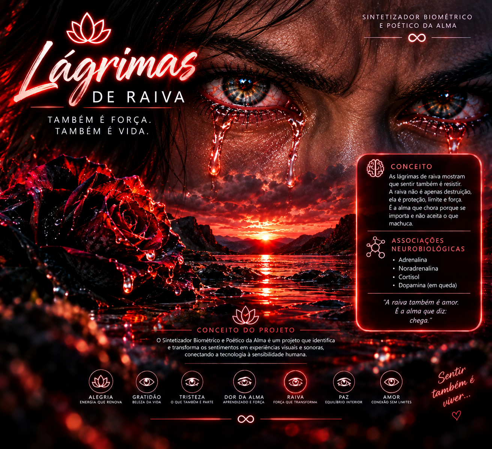

# 💧 Sintetizador Biométrico e Poético da Alma
*Parte integrante do **Projeto 5º Elemento** ∞*

 

<!-- Capa Principal -->

 

### *"Gratidão não é só um sentimento, é um estado de presença que renova a alma..."*

---

## 🎨 O Conceito Surrealista e Poético

O **Sintetizador Biométrico e Poético da Alma** é um experimento de código autoral que traduz a química, a física e a sensibilidade do sentir humano em uma interface digital imersiva.

---

## 🖼️ Galeria do Portal de Emoções

| 🌅 Nascer do Sol | 🟡 Gratidão |
| :---: | :---: |
|  |  |

| 🟠 Alegria | 🩵 Paz |
| :---: | :---: |
|  |  |

| 🔵 Tristeza | 🔮 Medo |
| :---: | :---: |
|  |  |

| 🟣 Dor da Alma | 🔴 Lágrimas de Raiva |
| :---: | :---: |
|  |  |

---

## 🧬 Biomecânica e Neurobiologia dos Sentimentos

* **Nascer do Sol:** Renovação celular com carga de *Endorfina* e *Dopamina*.
* **Gratidão:** Ativação de *Oxitocina*, *Serotonina* e *Dopamina*.
* **Alegria & Paz:** Equilíbrio biológico, serenidade e energia vital.
* **Tristeza & Medo:** Acolhimento, proteção e liberação emocional através da lágrima.
* **Dor da Alma & Lágrimas de Raiva:** Transformação da dor em resistência e força interior (*Adrenalina* e *Cortisol*).

---

**Desenvolvido por Donizete (donigemini)**  
*Porque sentir também é viver... ∞*

