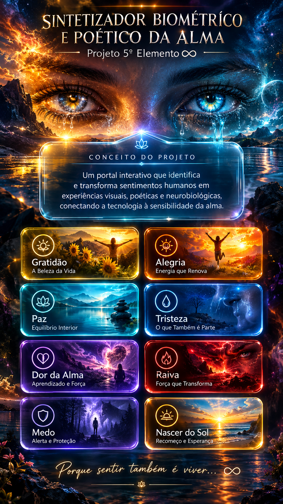
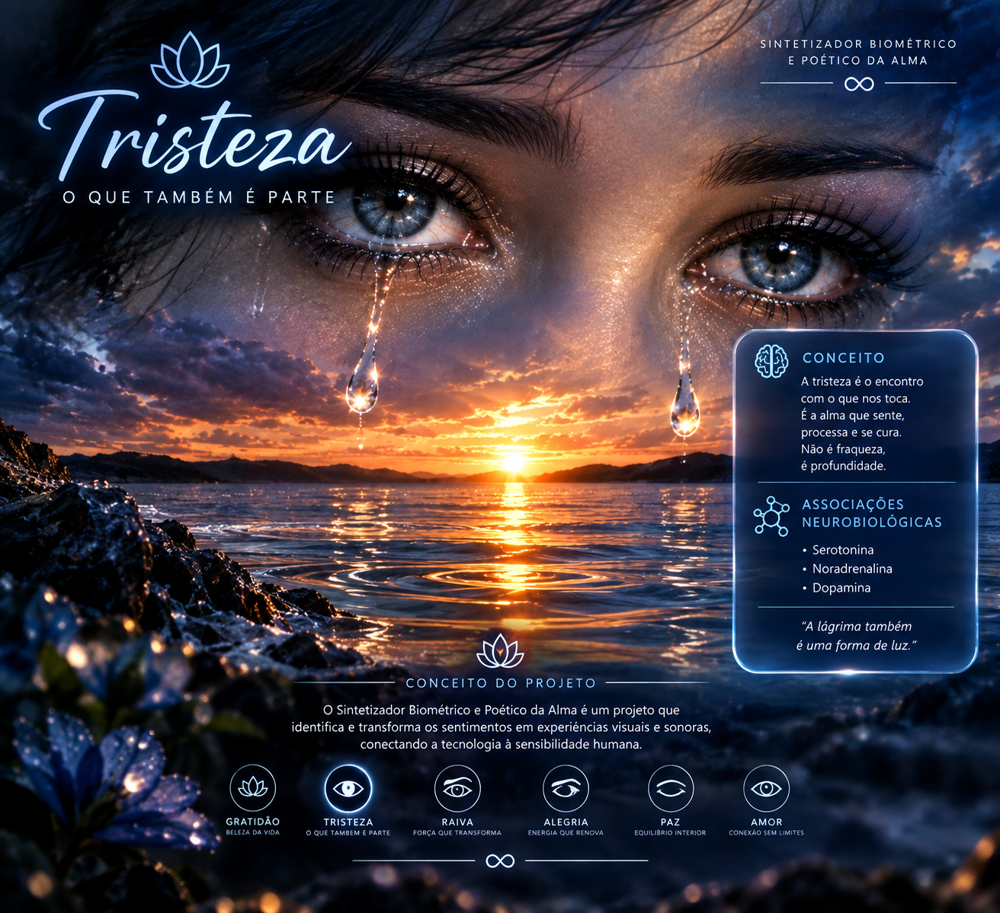
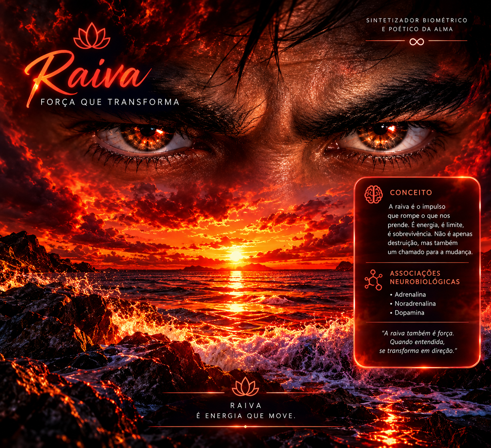
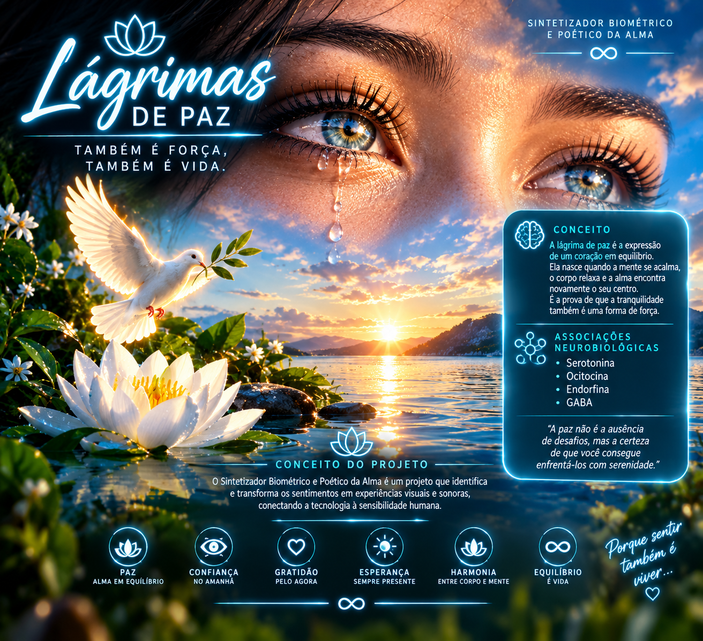

# 💧 Sintetizador Biométrico e Poético da Alma
*Parte integrante do **Projeto 5º Elemento** ∞*

 

<!-- Banner de Capa Principal -->

 

### *"A gratidão abre o coração e faz a vida florescer..."*

---

## 🎨 O Conceito Surrealista e Poético

O **Sintetizador Biométrico e Poético da Alma** é um experimento de código autoral que traduz a química, a física e a sensibilidade do sentir humano em uma interface digital imersiva.

Imaginativamente construído sobre a atmosfera de um pôr do sol, o sistema simula a transição de estados emocionais profundos — unindo **artes visuais surrealistas em glassmorphism**, mapas neurobiológicos e expressões poéticas.

---

## 🖼️ Galeria do Portal de Emoções

| 🌅 Dashboard Principal | 🟡 Gratidão |
| :---: | :---: |
|  |  |

| 🔵 Tristeza | 🔴 Raiva |
| :---: | :---: |
|  |  |

| 🩵 Paz | 🌅 Nascer do Sol |
| :---: | :---: |
|  |  |

---

## 🧬 Biomecânica e Neurobiologia dos Sentimentos

Cada tela sintetiza a relação química das emoções no corpo humano:

* **Gratidão:** Ativação de *Oxitocina*, *Serotonina* e *Dopamina*.
* **Tristeza:** Expressão de acolhimento e liberação emocional através de lágrima cristalina.
* **Raiva:** Elevação de *Adrenalina*, *Noradrenalina* e *Cortisol*.
* **Nascer do Sol:** Renovação celular com carga de *Endorfina* e esperança.

---

**Desenvolvido por Donizete (donigemini)**  
*Porque sentir também é viver... ∞*

